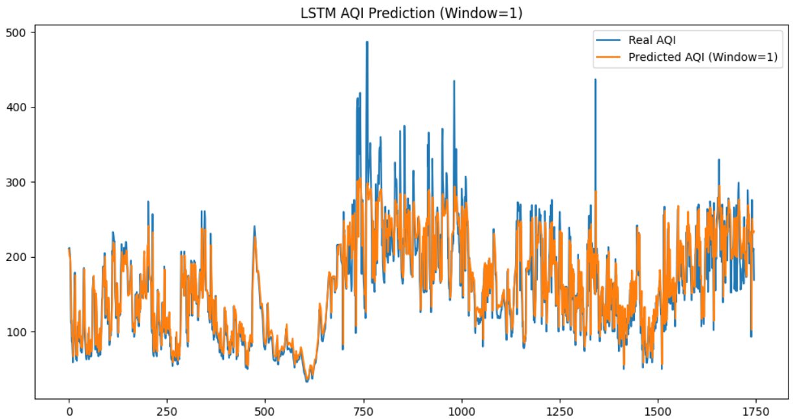
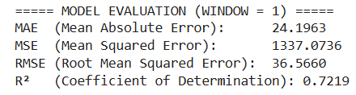
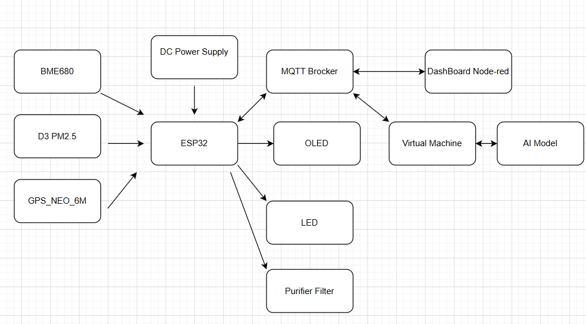
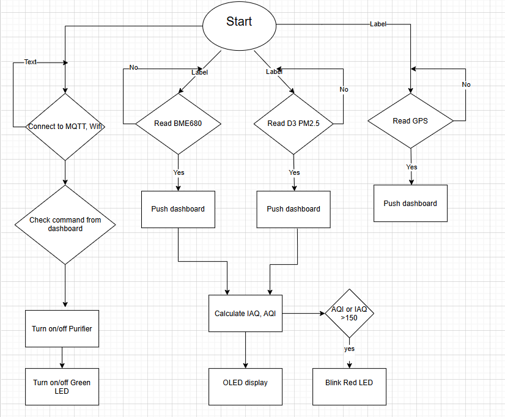
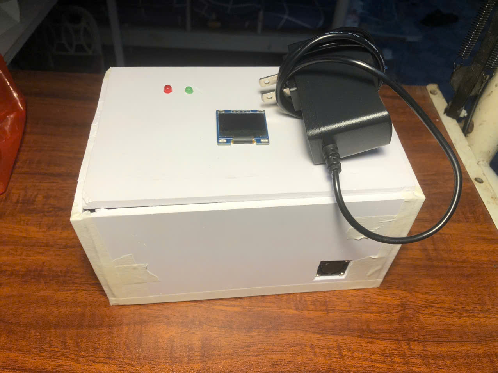
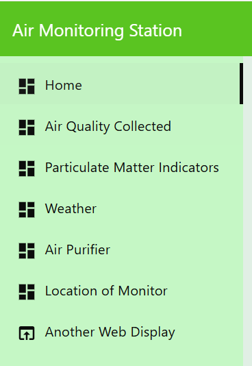
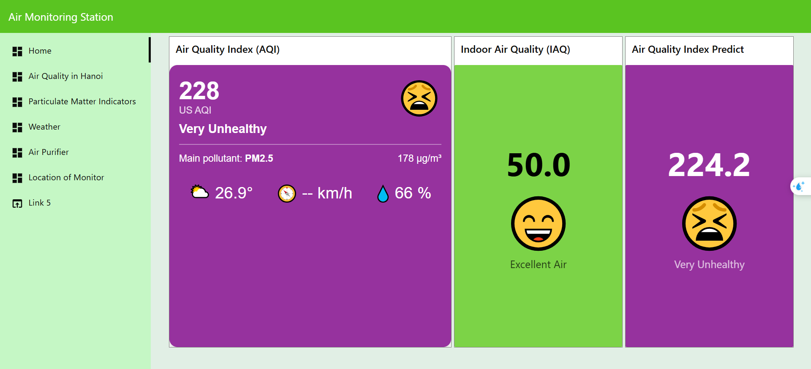
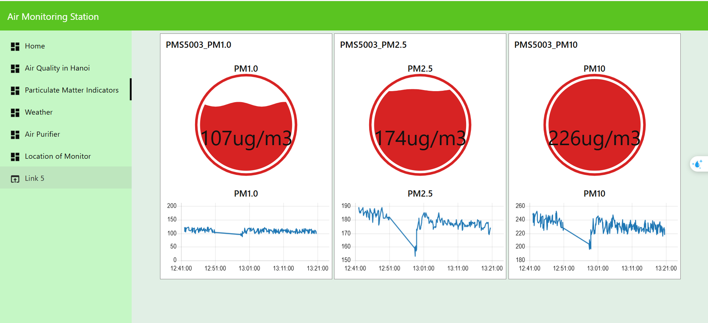
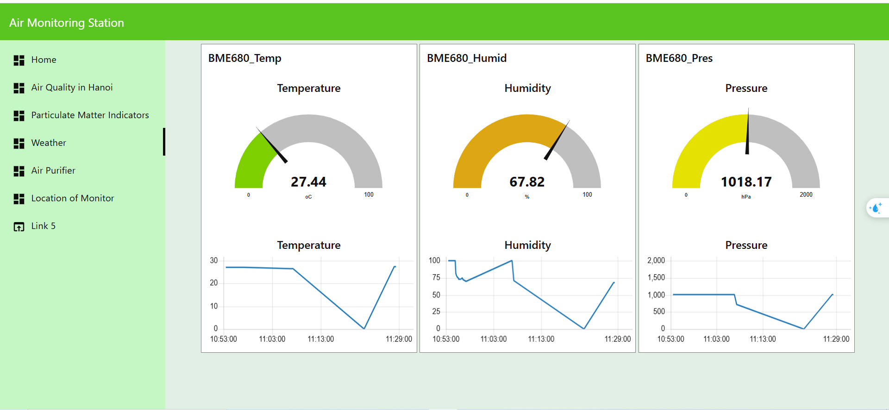
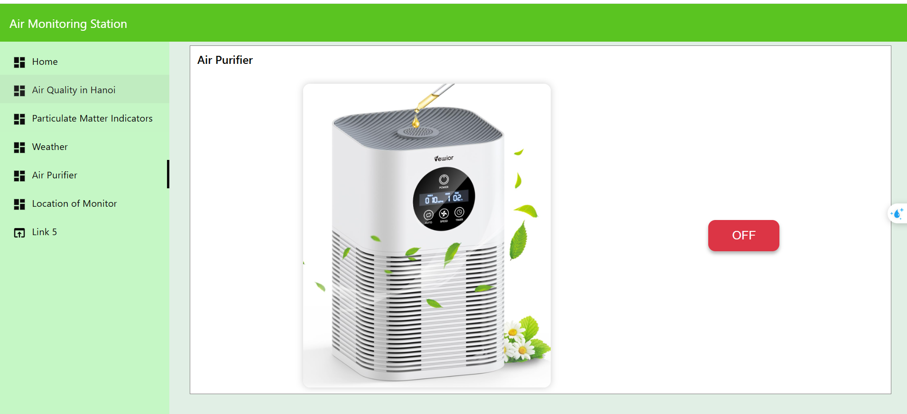

# Air Monitoring System

## Problem Statement
### Real-World Demand

In the face of rapid urbanization, air quality has become a significant concern impacting public health. Traditional methods of air monitoring are often insufficient, leading to delayed responses to pollution and hazardous conditions. This highlights the urgent need for an intelligent air monitoring system capable of:

_ Multi-Parameter Monitoring: Continuously tracking crucial environmental indicators such as PM2.5, Temperature, Humidity, Pressure, and VOC levels.

_ Enhanced Safety Alerts: Automatically detecting and warning of potential risks like high pollution levels, toxic gas leaks, or abnormal temperature changes.

_ Automation and Accessibility: Developing a cost-effective, easy-to-deploy system that makes advanced environmental monitoring accessible to a broader range of users.

### Inspiration for the Project

Toxic Gas Risks: Incidents of gas leaks and poor air quality in urban areas underscore the importance of automated detection and alerts.

Data Stability: Many existing systems struggle with accuracy and real-time data display, making reliable sensors and user-friendly interfaces crucial for better decision-making.

## Main Content
### Hardware Components
#### Hardware List
Component	Quantity	Function :

_ESP32 DevKit	Central processing, control, and network connectivity.

_BME680 Environmental Sensor	1	Measures Temperature, Humidity, Pressure, and VOC/Gas Index.

_ PMS5003 Dust Sensor	1	Monitors PM1, PM2.5, PM10 concentrations.

_GPS Module (NEO-6M / ATGM336H)	1	Provides GPS coordinates (Latitude, Longitude, Satellite count).

_OLED Display (I2C)	1	Displays real-time environmental data.

_LED Warning Indicator	1	Alerts when air quality thresholds are exceeded.

_Cables + Power Source	—	For wiring and powering the system.

### Software Overview

#### Node-RED Dashboard

_Visualization: Displays real-time data for PM1, PM2.5, PM10, Temperature, Humidity, Pressure, location of monitor, AQI, IAQ .

_Management: Set alert thresholds, control system status, and monitor historical data.

_Safety Monitoring: Receive alerts for high pollution levels, toxic gases, and abnormal temperature or humidity.

#### MQTT Broker

_EMQX used for real-time data transmission.

_ESP32 publishes sensor data to the broker.

_Node-RED subscribes to this data and updates the dashboard accordingly.

_Virtual machine subcribes and publishes value

#### Development Environment

_PlatformIO with VS Code.

_Virtual Machine (VMWare or Install on your window)

_Google Colab to train model

#### System Concept

Data Collection:

_PMS5003 measures particulate matter (PM2.5, PM10).

_BME680 captures temperature, humidity, pressure, and VOC levels.

_GPS module provides location coordinates.

Local Processing:

_The ESP32 processes sensor data, checks against thresholds, and updates the OLED display.

_The LED indicator provides a visual warning when air quality falls below safe levels.

Cloud Communication:

_ESP32 sends data to the MQTT broker.

_Node-RED retrieves and visualizes this data on the dashboard.

_Virtual Machine subcribes and publishes to broker to predict the AQI

Visualization & Alerts:

_The dashboard shows real-time data and alerts for any abnormal conditions.

_Users can set thresholds and receive notifications for environmental hazards.

## AI model

In this project I used LSTM model to predict the AQI in next hours.

Here is the compare table between real index and predicted index

## Block Diagram 
1. Block Diagram

2. Algorithm Flow Chart

## Pin Diagram
3. Pin Diagram

## Result
1. Model:

2. Node-red dashboard 2.0 :

. The Node-red dashboard consists of 7 Tabs: Home, Air Quality Collected, Particulate Matter Indicators, Weather, Air Purifier, Location of Monitor, Another Web.

.The Home interface displays AQI, IAQ, Temperature and Humidity and give the thresholds alert.

. The Particulate Matter Indicators displays 3 types of PM : PM1, PM2.5, PM10 collected that time.

. The Weather displays Temperature, Humidity, Pressure readings, along with historical data over time.

. The Air Purifier to turn on/off if the air is poluted

. The Location of Monitor 

. The Another Web helps people compare the air quality index at their home with other locations.

## Conclusion
. Air Monitoring system has been successfully developed with the following features:

  Collects data from sensors

  Provides warnings to users through a blinking LED

  Successfully uses an AI model to predict AQI with high accuracy

  Includes a database suitable for various applications

. The MQTT protocol has been successfully implemented to transmit and receive data between system components via brokers like HiveMQ or EMQX.

# Video Demo
Link gg Drive : https://drive.google.com/file/d/1JtE_UMB9cyV8rW0lYHocKMN55pcUekPe/view?usp=sharing

